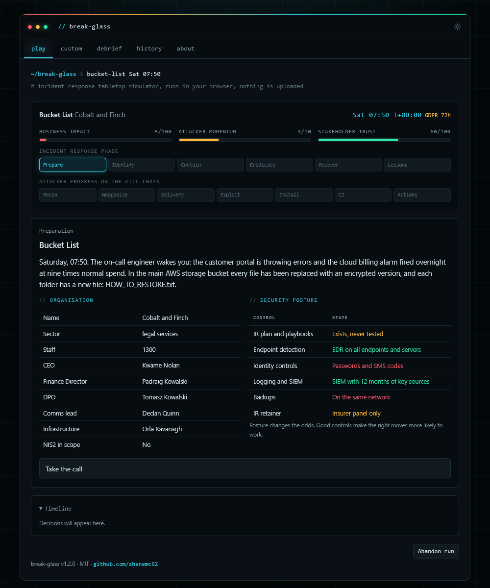

# break-glass

Browser-based incident response tabletop simulator. You are the lead analyst; each run drops you into a scenario at a fictional organisation with a randomised security posture, and you work it through to lessons learned. Single file, no dependencies, no network calls. Open `index.html` and play, including from `file://`.



## What it does

- Fifteen scenarios built on current attack methods: help desk social engineering to ESXi ransomware, edge VPN zero-day, AiTM token theft to invoice fraud, ClickFix infostealer to SaaS data extortion, indirect prompt injection against an internal AI agent, a North Korean fake IT worker, an npm supply chain worm, leaked cloud keys to S3 SSE-C ransom, hacktivists on an exposed OT control panel, ransom DDoS as cover for credential stuffing, a departing insider exfiltrating the customer database, a rogue cellular network implant, an MSP/RMM supply chain compromise, a destructive wiper disguised as ransomware, and an exposed storage bucket reported by a security researcher.
- Full SANS PICERL lifecycle every run, ending in a scored lessons learned phase.
- Every decision rated Poor to Best. Good actions still roll against odds shaped by difficulty and the organisation's controls; poor ones occasionally get lucky.
- Branches: flagged paths (tip off the attacker, patch without checking, dismiss the evidence), heat-driven escalation, and a failure path when business impact hits 100.
- 26 injects: regulators, NIS2, insurers, journalists, the board, and the quirky ones (rat in the fibre duct, server room barbecue, the CEO's nephew with a USB stick).
- Kill chain and MITRE ATT&CK (plus ATLAS and ATT&CK for ICS) tagging on every situation.
- Optional analyst checks: name the technique or kill chain stage before the outcome is revealed. The check never uses a technique whose name is already on screen, and toggling checks off doesn't change the dice for a seed.
- Scored debrief with summary, attack path, timeline, decision review and lessons learned. Save as Markdown or JSON, or print to PDF.
- Custom mode: a separate tab to enter a client's organisation, people, suppliers and real control posture. Blank fields stay random, and profiles save and load as JSON for reuse.
- Workshop mode: discussion prompts and projector-sized text. Seeds make every team face the same organisation and dice.

## Files

| File | Purpose |
|---|---|
| `index.html` | The built game. This is the only file you need to deploy |
| `src/data_core.js` | Phases, kill chain, controls, technique library, name pools, shared nodes |
| `src/data_injects.js` | Random injects |
| `src/data_scen1.js` to `src/data_scen4.js` | Scenarios |
| `src/engine.js` | Game rules, no DOM |
| `src/ui.js`, `src/markup.html`, `src/extra.css` | Interface |
| `template.html` | The shared single-file tool shell |
| `build.py` | Splices `src/` into the template to produce `index.html` |
| `test.js` | Content validator plus a 5,000-run balance simulation |

## Build and test

```
python3 build.py
node test.js
```

`test.js` fails loudly on missing technique IDs, unknown controls or organisations, unresolved `{tokens}`, flags that are never set, non-ASCII text, runs that don't terminate, an answer-length tell (the best option being the longest in more than 40% of decisions), a quiz answer that can be read off the screen, or the analyst-check toggle changing a seed's dice. It then prints average score, fail rate and escalation rate per scenario for random, best, worst, mid and mixed strategies.

## Adding a scenario

Push a new object onto `SCEN` in a data file. Nodes run in array order unless an option sets `next`.

Write the best option no longer than the plausible wrong ones and put the detail in `w`. Write `obs` as plain behaviour without the technique's name, and set `noquiz: true` on nodes where the decision itself is identifying the technique. `node test.js` will tell you if you slip.

```
{ id, name, blurb, tags: ["pii", ...], start: [dayIndex, hour, minute], orgs: ["optional org names"],
  actor, sum, escSum, intro,
  pre:   [{ kc, att, txt }],                 // what happened before detection
  nodes: [{ id, ph, kc, title, text, art, att, obs, disc, opts, if, unless, at, enter, hours }],
  esc:   { id: "ESC", ... },                 // fires once when momentum hits 6
  ll:    { id: "LL", ph: "lessons", ... } }  // scenario-specific headline fix
```

Options: `{ q: 0-3, t, r, f, w, u: ["idp"], set: "flag", esc: true, fx: { impact, heat, trust, hours }, next }`. `q` is the rating, `r` the result, `f` the failed-roll result (a generic one is picked if omitted), `w` the teaching point, `u` the controls that change the odds.

## Notes

Organisations, people and vendors are fictional. IPs are from documentation ranges. Regulatory timelines are simplified for training and are not legal advice.

## Licence

MIT. See `LICENSE`.
